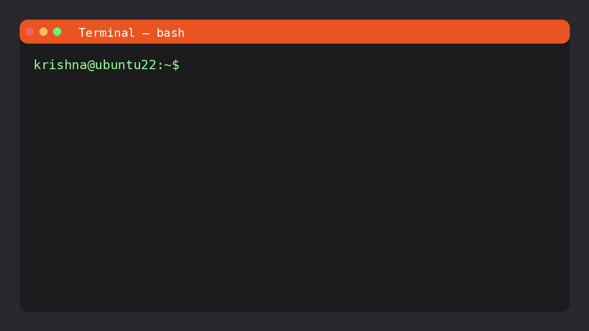

# create-nodejs-app

CLI to scaffold a production‑ready Node.js project in JavaScript or TypeScript. Defaults to TypeScript and includes opinionated setup for auth, databases, queues, logging, migrations, and more.

## Demo



## Install

- Using npx (recommended):

```bash
npx @sai_krishna_m/create-nodejs-app my-app
```

- Or install globally:

```bash
npm install -g @sai_krishna_m/create-nodejs-app
create-nodejs-app my-app
```

## Usage

```bash
create-nodejs-app <project-name> [options]
```

- Interactive (prompts for language, defaults to TS):

```bash
create-nodejs-app my-app
# Select language (ts/js) [ts]:
```

- Non‑interactive (explicit language):

```bash
create-nodejs-app my-app --lang ts
create-nodejs-app my-app --lang js
```

### Options

- `-l, --lang <lang>` Language to scaffold: `ts` or `js` (default: `ts`)
- `-h, --help` Show help

## After scaffold

```bash
cd my-app
npm install
npm run dev   # or see template README for scripts
```

## What you get

Both templates share a similar modular structure and include:

- Auth: JWT authentication/authorization
- Databases: MySQL and MongoDB setup (choose per project)
- Services/repositories: Layered service pattern
- Jobs & queues: BullMQ + Redis wiring
- Logging: Winston with daily rotate
- Migrations/seeders: Sequelize CLI
- Environments: `.env.dev`, `.env.sit`, `.env.uat`, `.env.production`
- Process manager: PM2 ecosystem file

## Templates

- TypeScript: `templates/node-base-template-ts`

  - Entry: `src/app.ts`
  - Scripts: `dev` (ts-node-dev), `build`, `start`, `migrate:dev`, `seed:dev`
  - Includes type definitions and `tsconfig`

- JavaScript: `templates/node-base-template-js`
  - Entry: `src/app.js`
  - Scripts: `dev`, `migrate`, `seed`

Each template also carries its own README inside the generated project for details and scripts.

## Examples

- Create a TypeScript API (default):

```bash
npx @sai_krishna_m/create-nodejs-app api-ts
```

- Create a JavaScript API:

```bash
npx @sai_krishna_m/create-nodejs-app api-js --lang js
```

## Notes

- If the target directory already exists, the CLI aborts to avoid overwriting.
- The CLI only scaffolds files; it does not install dependencies for you. Run `npm install` inside the new project.

## License

MIT © Sai Krishna
